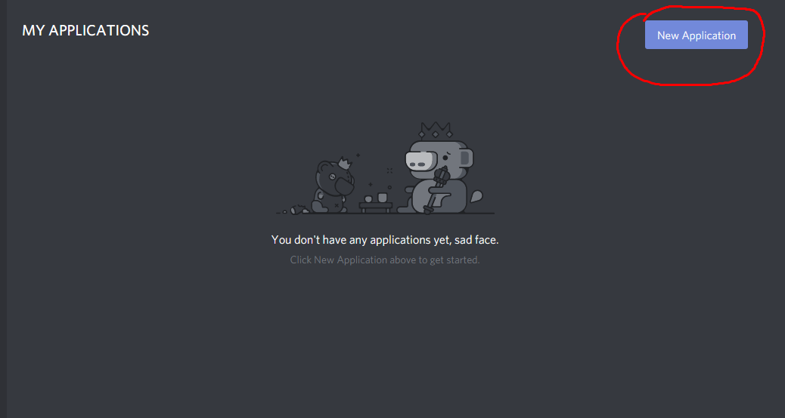
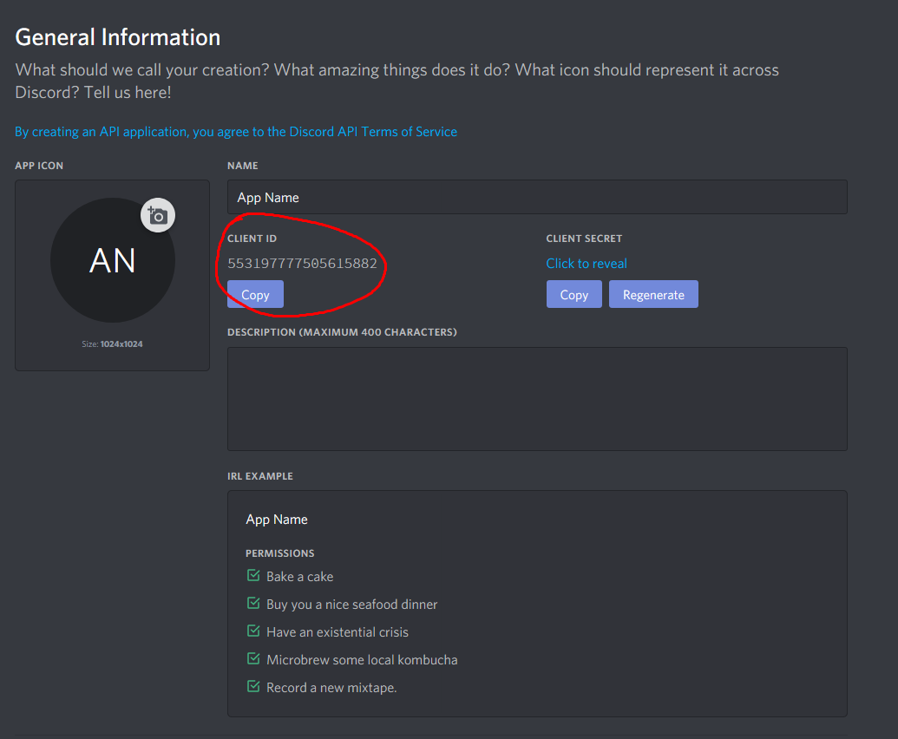
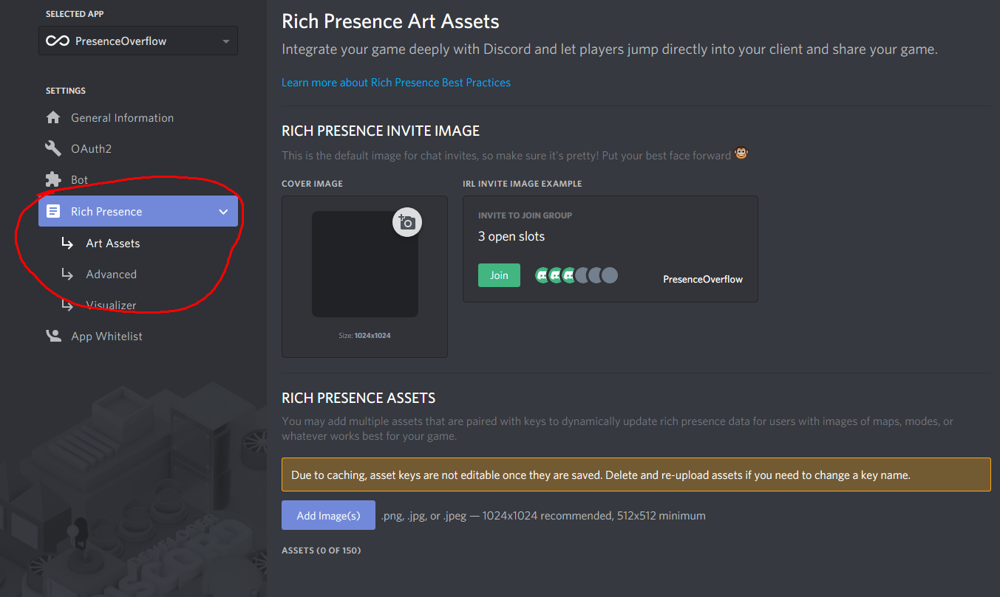
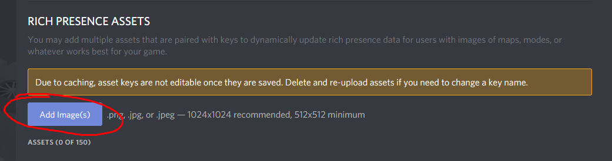
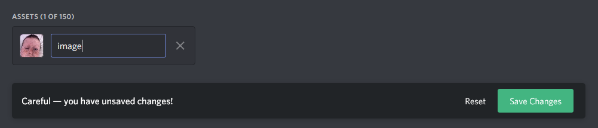
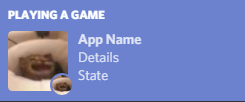

# PresenceOverflow
Modifies your Discord Rich Presence with a nice UI.  
You can download the most recent version [here](https://github.com/woahoverflow/PresenceOverflow/releases/download/v0.2.0-ALPHA/PresenceOverflow-0.2.0-ALPHA.jar).

## How to
To begin, head over to [here](https://discordapp.com/developers) and make sure you're signed in. After that, click on "New Application" on the dashboard. 
After that, create a name. This name does matter towards your presence. It's the bold lettering at the top (see the bottom). Copy the "Client ID" from this dashboard.

Once you've completed that, head back to your PresenceOverflow client. Put the Client ID into the client id section, and then insert a state. You only need a state, the others are optional. Once you've inserted what you want, click reload at the top right of the client. The "Unloaded" should turn into "Updated!".
You can now simply close it, and get it back by opening your toolbar full of icons on the far right of your taskbar.

## How to add images
Make sure you've followed How To above before this.  
Go back to your [Discord Developers Dashboard](https://discordapp.com/developers), and go to the Art Assets section.

Go near the bottom, and click "Add Image(s)"

After that, upload an image and select a name.
Like it says, you cannot switch this name after.

The name you selected in the dashboard, is what you'll put in your PresenceOverflow client. Make sure to add a caption to that image size as well.

  
 
If you hover over either of the images, the caption for that size would show.

## Disclaimer
This tutorial is intended for version(s) **v0.2.0-ALPHA**
